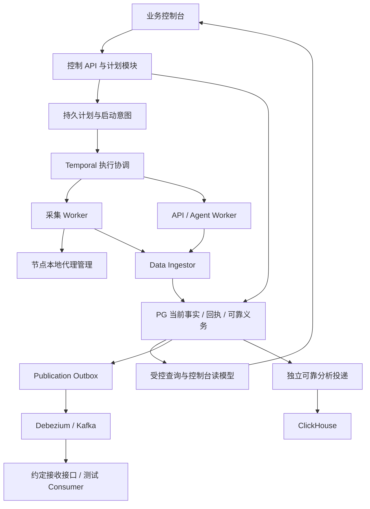

# 爬虫业务平台开发计划（讨论稿）

版本：0.4｜日期：2026-09-23｜状态：主要产出范围明确，M1 任务分工已编写，业务实现尚未启动。

这份计划用于决定先做什么、交付什么、怎样证明做到。当前完成的是规划与代码入口核对，业务代码尚未开始实现。M1 的实际分工见[M1 三 Agent 任务与协作](m1/README.md)，分别规定公共基础、执行器和控制台的交付责任。

## 1. 已确定的方向

| 事项 | 当前结论 | 依据或状态 |
| --- | --- | --- |
| 第一版产品 | 先完成爬虫采集管理平台，预留下游业务数据交付接口 | 用户本轮确认 |
| 核心质量目标 | 高性能、高并发、高可伸缩性、高可靠性、高安全性、高可观测性、易用性、高可维护性 | 用户明确要求 |
| 旧代码定位 | 作为经验、实现和测试样例的参考；允许重新设计逻辑与结构 | 用户明确要求 |
| 新系统开发位置 | `/home/ubuntu/workspace/crawlsystem-business`，当前分支 `business/crawler-platform` | 已核对 |
| 旧代码参考位置 | `/home/ubuntu/workspace/oldsystem`，分支 `agent/incremental-migration-release` | 已克隆并核对 |
| 旧数据与在途任务迁移 | 先用独立数据验证新系统；旧数据迁移单独评估 | 用户本轮确认 |
| 单频道完成后的必要产出 | 频道基础信息、视频与评论、Agent 分析结果；字段从旧代码和数据库结构梳理 | 用户明确方向，已建立源码字段参考 |

需求解释顺序：用户最新明确要求 → 本轮及后续确认的业务契约 → 新系统设计决策 → 既有方案与旧代码参考。质量目标决定实现标准；采什么、何时更新、何时算成功等产品行为，需要在业务契约中明确。

[24.8 重构方案](24.8_爬虫平台完整重构方案_数据增长与存储治理版.md)继续提供架构、业务与验收参考。其中“必须继承旧规则”的要求按用户最新说明重新评估；旧代码中的阈值、经验公式、状态和重试次数，不自动成为新系统需求。改变已经明确确认的业务产出时，记录具体影响并讨论；内部实现调整可以依据实验推进。

既定基础设施作为实施起点。参考旧代码的授权不等于要更换已经部署的基础设施；如发现不适配，先形成具体证据和替代建议。

## 2. 当前起点与证据边界

- 新仓库主要包含基础设施部署资料与 24.8 方案，尚无新业务应用代码。
- [基础设施进度报告](crawlsystem-infra-a1-s3/reports/DEPLOYMENT-PROGRESS.md)记录六节点已部署，仍待实际 48 小时观察验收；本次未连接服务器复查，也未把基础设施测试当成业务容量验收。
- 旧代码本次参考提交为 `e92d9227a5a3847430e5d062bea13227564ee419`。24.8 附录引用的是更早的 `10a43473232d70a76bdcf4c7312d4cb833642af3`，两者不能当作同一份代码。
- 已查看旧仓库说明、包依赖、模块目录和部分执行入口；未运行旧系统，未完成源码审计，未验证模型文件及其推理质量。

| 旧系统入口（相对 `oldsystem/`） | 可提供的参考 | 新系统需要重新决定的内容 |
| --- | --- | --- |
| `services/qybullmq/src/fullCrawlYoutubeJsFactory.js` | 频道准入、扫描、详情提取、阶段处理 | 采集范围、完成条件、计划编排 |
| `services/qybullmq/src/incrementalChannelRunner.js`、`incrementalPlan.js` | About / Video / Agent 分域执行 | 更新策略、状态机、依赖与并发控制 |
| `services/qybullmq/src/videoDetailApiFallback.js` | 字段补充、来源证据与特殊内容处理 | 补充条件、费用预算、估算值是否允许及如何展示 |
| `services/qybullmq/src/remoteNodes/`、`services/remote-node/` | 节点执行、结果暂存、恢复经验 | 接入协议、身份与写入权限、部署方式 |
| `services/local-agent/` | Python 画像处理、模型与测试样例 | 输出字段、模型选择、质量评估、独立执行预算 |
| `services/feature-engine/`、`services/feature-dispatch/` | 更新时钟和派发经验 | 新系统的策略、到期计算与调度职责 |
| `services/dashboard/`、`services/auth/`、`services/rota/` | 操作场景、鉴权和代理资源经验 | 新控制台交互、权限边界与节点本地代理管理 |

旧测试用于发现业务场景与边界，不以“所有旧测试原样通过”作为新系统唯一验收标准。原样复用、适配、重写或舍弃，都应能说明与新需求的关系。

## 3. 产品范围与优先级

第一版面向采集操作人员和平台维护人员。具体用户数、团队隔离与角色范围在需求阶段确定。

| 能力 | 首个贯通演示 | 第一版平台完成时 |
| --- | --- | --- |
| 频道与数据 | 手动添加频道；查看约定范围内的真实数据、来源与采集时间 | 频道、视频、约定评论数据及完整性、新鲜度查询 |
| 计划与执行 | 创建一个目标明确的基础采集计划，查看阶段与结果 | 首次采集、持续更新、依赖等待、取消、恢复与重试 |
| Discover / Query | 后续阶段实现 | Query 管理、搜索发现、候选准入与来源关联 |
| API / Agent | 完成一个频道所需的真实 Agent 分析，接入必要 API 补充与等待恢复 | 官方 API 补充、画像分析、组批、配额与版本管理 |
| 节点与代理 | 最小可用身份、一个实际执行节点、代理额度与健康状态 | 节点接入、Worker 管理、代理分配、暂停新增和排空 |
| 发布交付 | 定义发布资格、版本与接口边界 | 版本化交付契约、发布状态与受控接收端验收；下游业务应用另立范围 |
| 历史与存储 | 当前事实、最小恢复记录、数据生命周期登记 | 约定的历史分析、保留与清理、积压与容量视图 |
| 控制台 | 频道列表/详情、计划列表/详情、基础节点状态 | 首页、发现、采集、更新、API/Agent、资源、交付、错误与配置 |

首个演示只证明选定场景贯通，第一版完整范围要在需求阶段形成清单。演示范围较小不能自动改写正式 Full、Update 或发布的成功标准。

客户管理、营销流程、线索跟进等下游应用不纳入当前第一版。Kafka/CDC 等交付能力沿既定方案接入，用测试接收端证明契约，不虚构下游应用已经接受数据。

### 3.1 单频道完成后应交付什么

单频道产出按频道基础信息、视频与评论、Agent 分析结果梳理。用户明确要求直接查看旧代码及数据库结构获取数据范围；据此建立了[业务数据范围：旧系统字段参考](业务数据范围_旧系统字段参考_2026-09-23.md)。此前提出的视频质量评价属于误加范围，已移除。

| 产出 | 已核对的旧系统结构 | 新系统落实内容 |
| --- | --- | --- |
| 频道基础信息 | `crawler.channels`：身份、名称、头像、简介、国家、注册时间、订阅/播放/视频总量、外部链接、认证与商务邮箱入口状态等 | 字段映射、来源/时间/状态与当前版本 |
| 视频数据 | `crawler.contents`：视频身份、类型、标题/描述、缩略图、发布时间、时长、播放/点赞/评论数、访问状态、直播时间等 | 稳定身份、目标范围、有界入库与字段证据 |
| 评论 | `crawler.contents.comments_first_page`：首屏正文、作者、时间、点赞/回复数及置顶等标记，另有评论总数和关闭状态 | 首屏结构、排序、合法空结果与缺失恢复 |
| Agent 分析结果 | `crawler.agent_profiles.metrics_json`：国家、创作者性别/年龄/语言、受众地区/年龄性别/语言分布、活跃订阅比例、标签和分类 | 十项结果的输入输出契约、来源证据、输入/模型版本及展示 |

字段清单以核对到的 DDL、写入与输出契约为参考；上游未提供的字段保留明确状态。视频/评论采集范围与旧配置继续对照，形成具体建议，不将“频道采集完”自动解释为抓取全部历史视频和全部评论。新表结构和执行逻辑按八项质量目标设计。

根据必要产出形成的完成判定建议：

1. 本轮要求的基础信息、视频和评论目标均已按契约处理，结果已持久保存。
2. Agent 已针对本轮认可的输入版本产出有效结果；调用返回成功但结果缺失或不合格时，不计为频道完整成功。
3. 缺失字段、受限内容、关闭评论、输入不足等情况记录明确状态；哪些情况允许完整成功、部分完成或仅结束处理，在合同中逐项确定。
4. 已采到的数据可以先展示；Agent 等必要项尚在等待时，页面继续显示本轮未完整完成。外部交付状态另行显示。
5. Agent 的输入满足契约后即可安排执行；何时并行由输入依赖决定，返回结果校验输入版本，避免旧分析覆盖新数据。

首个正式“单频道完整采集”演示包含所需 Agent 分析。开发过程中可以先验证采集和入库子流程，并明确展示其完成范围；Agent 批处理与进一步优化留到 M3。

## 4. 八项质量目标如何验收

| 目标 | 设计要求 | 需要保存的验收证据 |
| --- | --- | --- |
| 高性能 | 分开计算接口响应、排队、采集、入库、计划完成与交付耗时；按有效结果统计吞吐 | 代表性负载下的 P50/P95/P99、有效入库量、成功计划量及瓶颈分析 |
| 高并发 | 并发、内存、连接池和队列均有预算；限流与背压可解释 | 阶梯加压曲线、排队年龄、资源峰值、拒绝/等待原因、降载后的恢复表现 |
| 高可伸缩性 | Worker 可横向扩容；数据侧、代理及下游具备容量约束 | 固定负载与同规格资源的扩容对照，记录有效产出和限制因素 |
| 高可靠性 | 持久确认、幂等、版本校验、检查点和可恢复义务；关键字段保留来源及未知状态 | 重放、确认丢失、进程强杀、数据库切主、迟到结果与恢复对账 |
| 高安全性 | 身份验证、对象级授权、最小权限、标准加密、凭据隔离和审计 | 正常访问与越权拒绝用例、传输验证、日志脱敏、依赖与镜像检查 |
| 高可观测性 | 业务状态来自持久事实；任务到结果可关联，指标口径可核对 | 从页面定位指定故障的演练、告警发现时间、定位时间和证据缺口记录 |
| 易用性 | 中文状态、清晰反馈、合理默认值、操作权限与防误触 | 用户完成添加频道、查失败、恢复任务、暂停新增等场景的耗时与误操作记录 |
| 高可维护性 | 模块边界明确、契约有版本、迁移可验证、构建与发布可重复 | 类型/静态检查、关键行为测试、数据库升级演练、修复与发布记录 |

质量目标从第一个闭环开始落实；后期阶段负责扩大场景、压力与故障覆盖。

### 4.1 先定义统计对象，再确定数字

以下数值尚未确认，不写成已经满足的承诺。没有现成业务预测时，先用代表性小样本测量，再讨论可接受目标。

| 待确定参数 | 用途 | 确定时机 |
| --- | --- | --- |
| 纳管频道量、每日新增量、每日更新量、峰值提交量 | 确定持续负载与峰值测试模型 | M0 初始范围，M2 后校准 |
| 每频道视频/评论范围，语言/国家及 API/Agent 比例 | 确定一次业务任务实际工作量 | 对应功能开发前 |
| 页面/API P95、频道数据可用时限、允许排队时长 | 确定响应与新鲜度目标 | M0 初值，M2 实测校准 |
| 外部请求额度、代理资源、计算费用预算 | 确定最大准入与并发 | 真实采集前 |
| 支持的故障范围、RPO、RTO | 确定持久确认、恢复与备份要求 | M1 设计；M5 验收 |
| 当前数据生命周期、历史精度、保留期与磁盘预算 | 确定表、索引、分析与清理设计 | 新数据集落地前 |
| 峰值持续时间、扩容效率门槛、稳定运行观察窗口 | 确定容量与上线门槛 | M5 压测前 |
| 告警发现/故障定位/恢复目标、关键操作完成时间 | 确定可观测性和易用性验收 | M0 初值，演练后校准 |

可靠性的“零丢失”要注明数据已到哪种持久确认点、覆盖什么故障；“零差错”转成关键不变量、字段校验与对账要求。模型推断和上游事实分开标识，模型质量用有标注样本评估。

MTTD 通常指平均发现时间，故障定位时间单独记录；MTTR 标明修复或恢复的起止点。MTBF 需要长期运行样本，不能从短时压测推导。

扩容效率按 `有效吞吐提升倍数 / 有效资源提升倍数` 比较，并固定工作负载、代理条件和外部配额。请求 QPS、入库批次、完成频道和业务交付是不同统计对象。

## 5. 实现方向建议

沿用既定组件作为基础，业务代码按清晰模块组织；需要独立资源预算的执行角色可分开部署。每个角色的副本数依据测量配置。

上图表达职责和数据路径，具体状态、同步点与恢复责任在 M1 定义。API/Agent 只在计划需要时执行，完成后恢复同一计划的原依赖阶段。

关键设计建议：

1. 控制、采集、结果接收、数据存储和交付各有明确接口；采集节点通过受控入口提交结果。
2. 先持久化计划与启动意图，再可靠启动 Temporal，覆盖“数据库已提交但流程未启动”的恢复窗口。
3. 稳定实体身份、计划身份、提交身份、字段来源、输入版本及执行权限在第一版契约中定义。
4. 写入使用有界批次与短事务；同提交重传返回已有回执，同身份异内容可识别；已提交后的响应丢失可查询核对。
5. 重试、取消、依赖等待和过期执行都有确定行为；取消后拒绝不再有权写入的新结果。
6. 入库完成、本轮完成、数据完整与业务交付分别建模；页面能同时显示已有可用数据和本轮等待状态。
7. 数据库连接、代理并发、外部配额和每类 Worker 槽位分别设预算；扩副本不自动增加全部额度。
8. 原始响应按诊断目的与期限保存；当前事实去重更新；业务恢复证据在仍需恢复/重放期间受到保护。

### 5.1 技术栈与工程组织（建议，尚未定案）

- 控制服务、执行适配和数据入口优先评估 TypeScript / Node.js，便于对接现有 JavaScript 采集资产与 Temporal SDK；运行版本及框架在 M1 锁定。
- 控制台建议 React + TypeScript，使用成熟组件库构建中文业务界面；先确定操作和状态，再实现完整导航。
- Agent 若复用有价值的 Python 模型能力，则通过版本化输入输出隔离；是否保留模型以质量、速度、资源与维护成本评估。
- 数据库迁移集中执行；同一代码库可产生不同执行角色的镜像或启动方式。复用已有运维工具查看底层系统。
- 新业务代码与旧仓库保持独立依赖关系；需要复用的实现按模块引入并记录出处，避免依赖开发机上的绝对路径。

新依赖在引入时说明用途、接口、维护成本与失败方式。当前不需要一次性选定所有库，也不因未来可能出现热点就提前实现分片系统。

## 6. 开发阶段与完成标准

用 M0～M5 表示可评审的交付里程碑，并映射 24.8 的阶段 0～9。它们是同一条实施路线；按最新需求调整先后次序，基础质量要求随功能一起落地。

| 里程碑 | 主要工作与交付物 | 完成标准 | 对应 24.8 阶段 |
| --- | --- | --- | --- |
| M0：需求与验收基线 | 首版功能清单、字段/成功条件、用户操作清单、负载初值、旧代码参考表、待定决策 | 首个场景的输入、输出、范围、完成与失败含义明确，能写出独立于实现的验收用例 | 0～1 |
| M1：契约与工程基础 | 模块骨架、数据契约、核心迁移、鉴权、计划状态机、Temporal 启动恢复、Ingest 最小入口、查询 API、首批状态页面、基础埋点、CI | 从干净环境可启动；固定样本贯通并可从页面追踪；重放、取消、越权及恢复验证通过；测试身份明确标识 | 1～3，5/7 的必要基础 |
| M2：首个真实贯通演示 | 真实采集适配、必要 Agent/API 依赖、节点/代理最小能力、检查点、幂等入库、频道与计划页面 | 人工添加频道后得到约定采集数据和 Agent 结果；中断可恢复；重放不重复生效；必要产出未满足不标完整成功 | 2～4，7 的首批页面 |
| M3：完整采集业务 | Full、Update、更新策略、Discover/Query、API/Agent 依赖与批处理，补齐操作页面 | 达到已确认的首版功能范围；并发与恢复场景通过；空结果、等待、部分完成和失败正确区分 | 4～5，7 |
| M4：交付、历史与存储治理 | 发布资格与固定版本事件、Outbox/CDC/Kafka、测试接收端、历史投递、保留与清理、容量视图 | 重复/乱序交付正确；接收端停机可恢复；历史统计可对账；存储增长与清理符合合同 | 6～7 |
| M5：容量与上线验收 | 阶梯负载、扩容对照、背压、故障恢复、安全与操作体验、灰度发布与回退演练 | 八项质量目标有对应证据；未满足项有明确范围与处理结论；生产容量基线可复现 | 8～9及业务级HA复验 |

依赖关系：M0 → M1 → M2 → M3 → M4 → M5。交付契约与生命周期设计从 M1 开始；早期性能、安全和恢复验证从 M1/M2 开始。实施可在接口明确后交错推进，完整平台验收必须覆盖全部已确认范围。

排期按里程碑推进。M0 明确范围、样本与投入后，再估算每个阶段的工作量；本讨论稿不把未知范围换算成固定上线日期。

### 6.1 M2：第一个应当能演示的结果

建议场景：操作人员手动添加一个 YouTube 频道，为约定的数据范围创建采集计划，页面显示执行进度、真实结果和可解释的等待/失败原因。

操作路径：

1. 用户登录，添加频道；系统校验目标并归一化身份。
2. 用户创建采集计划；界面展示本轮要采的字段与目标范围。
3. 系统在资源允许时执行，记录当前阶段、节点、检查点及必要关联信息。
4. 采集与 Agent 结果经校验入库后，频道页展示数据、分析结果及其来源/输入版本、时间；计划页展示各项状态。
5. 人为中断执行进程，再启动后恢复；可以核对已成功部分和剩余部分。
6. 重放已提交结果，验证实体、回执和完成计数没有重复增长。

首个场景的字段和视频/评论范围由 M0 明确，不从旧默认值猜测。开发中若先实现 About 或某个有限目标计划，应使用准确名称；不能显示为完整 Full 已成功。单频道完整采集必须包含有效 Agent 分析；若采集需要 API 补充，则等待该依赖完成并通过字段校验。

首批页面：频道列表与详情、计划列表与详情、基础节点/代理状态。用户能分辨数据已经可用、任务正在等待和本轮已经完成。

### 6.2 M3：建议的内部顺序

1. 完成正式首次采集合同及其必要的 API/Agent 支路。
2. 完成持续更新，明确 About、Video、Agent 各自的到期、成功推进与失败重试。
3. 接入 Discover/Query 自动发现、候选归并与准入，贯通“发现 → 首次采集 → 持续更新”。
4. 补齐批量操作、错误聚合、恢复入口与执行资源管理。

这种顺序先用可控目标验证采集和写入，再增加自动输入流量。Query 周期、三 Clock 具体算法、分类、样本量与组批数来自业务契约评审，旧值均需标明采用依据。

## 7. 验证策略与数据增长要求

| 验证层 | 覆盖内容 | 开始时机 |
| --- | --- | --- |
| 业务规则与契约 | 字段来源、未知/缺失/估算、完成条件、版本兼容、计划状态转换 | M0 定义，M1 起实现 |
| 数据库与事务集成 | 并发写入、唯一约束、同提交重放、事务中断与确认丢失 | M1 |
| 真实采集样本 | 代表性频道、上游限制、字段缺失、分页与合法空结果；保存有界脱敏证据 | M2 |
| 依赖与恢复 | API 配额等待、Agent 部分失败、旧结果迟到、取消、进程重启 | 对应功能加入时 |
| 交付与分析 | 重复/乱序事件、接收端停机、重放对账、分析去重 | M4 |
| UI 与权限 | 关键操作端到端验证、对象越权、旧页面提交、错误提示与恢复路径 | M1 鉴权；随页面加入 |
| 负载与故障 | 实际硬件上的阶梯加压、扩容对照、数据库/网络/存储故障与恢复 | M2 小规模，M5 全面 |

外部采集存在网络与平台波动：可重放样本用于验证内部正确性，受控真实采集验证实际适配效果；分别记录结果。吞吐测试覆盖冷/热数据、首次/更新、不同目标量及 API/Agent 比例。

每个新增数据集登记：用途、权威源、唯一身份、字段、写入频率、预计大小、索引、副本、保留期限、清理资格和维护模块。活动计划、未交付事件及重放仍依赖的证据不能被普通到期规则清掉。

必须验证三类增长场景：固定实体反复刷新、持续新增实体、下游停机后追赶。既检查重复刷新是否无意义增长，也检查恢复所需事实是否仍然存在。

## 8. 旧数据迁移与上线准备

已确认先用独立数据验证新系统，旧数据迁移单独评估。M0～M2 按此推进，无需等待历史数据或在途任务的迁移设计；若后续决定接管旧系统，再把迁移评估结果纳入相应的发布范围与验收。

| 如果选择 | 增加的工作 |
| --- | --- |
| 新数据起步，暂不迁历史 | 明确新旧系统的采集对象归属、结果使用范围和旧系统保留方式 |
| 迁移历史数据，重新安排任务 | 字段映射、稳定身份、分批导入、校验与对账、缺失来源标识、冻结/切换步骤 |
| 同时承接在途任务 | 进一步定义旧新状态与检查点映射、执行权切换、重复执行防护、预算与外部调用接续 |

发布前形成具体灰度与回退方案：代表性对象范围、准入上限、版本追踪、停止条件、执行排空、数据库兼容与交付版本处理。回退应用不能依赖直接删除已合法产生的数据。

基础设施报告记录了现有备份及故障恢复边界，包括当前缺少 PG 连续 WAL/PITR、部分组件存在单节点中断窗口。根据业务最终 RPO/RTO 判断是否需要追加能力；本计划不默认这些边界已经满足生产要求。

## 9. 当前待讨论事项

按影响排序逐项讨论，不要求一次回答所有技术问题。

| 编号 | 决策 | 当前建议或状态 | 影响 |
| --- | --- | --- | --- |
| D01 | 第一版产品范围 | **已确认：爬虫采集管理平台，预留下游交付接口** | 功能边界 |
| D02 | 旧数据和在途任务如何处理 | **已确认：先用独立数据验证，旧数据迁移单独评估** | 前期实施独立；后续迁移另行确定 |
| D03 | 首个采集场景及数据范围 | **按基础信息、视频/评论和 Agent 结果推进，字段直接参考旧代码与数据库**；已有字段参考文档，继续核对范围与状态规则 | M0～M2 的具体工作 |
| D04 | 更新、发现和画像规则 | 按业务结果评审；旧算法、分类、阈值和批量值作为候选 | M3 的契约与回归集 |
| D05 | 初始规模和可接受时效 | 无预测时先测代表性样本；确认期望量级 | 性能与容量目标 |
| D06 | 技术栈与部署模块 | TypeScript / Node.js + React 为建议；Python 模型按评估结果保留 | M1 工程组织 |
| D07 | 用户、权限与外部资源 | 明确操作者/只读角色、团队隔离、代理与 API/模型额度 | 鉴权、并发与费用预算 |
| D08 | 历史查询与恢复要求 | 明确历史精度、保留期、故障范围、RPO/RTO | 存储、备份与上线要求 |

## 10. 下一轮具体做什么

单频道字段基线已从旧系统结构与代码梳理。接下来将字段映射为新系统的数据契约，并对照旧配置给出采集范围与完成状态的具体建议；只把无法从现有资料确定的产品取舍留给讨论。按已经确认的独立数据验证方式，随后完成 M0 的三个小交付物：

1. **首版业务清单**：输入、目标数据、完整/部分/等待/失败的含义、用户操作与明确不在本版的功能。
2. **首个闭环验收清单**：正常采集、合法空结果、依赖等待、中断恢复、重复提交、越权拒绝、取消后的迟到结果。
3. **实施任务清单**：模块、接口、核心实体、依赖顺序与完成标准；相关旧代码只列有用入口和采用理由。

讨论得到的结论持续更新到这份计划。任务完成以可演示结果和验收证据为准，设计建议、用户确认与实际实现分别标记。

## 11. 变更记录

| 日期 | 版本 | 变化 |
| --- | --- | --- |
| 2026-09-23 | 0.1 | 建立讨论稿；记录八项质量目标和旧代码参考定位；确认第一版为采集管理平台、先用独立数据验证；提出 M0～M5 路线与首个贯通演示 |
| 2026-09-23 | 0.2 | 记录单频道基础信息、视频数据和 Agent 结果为必要产出；将必要 Agent 分析纳入 M2 正式完整采集演示 |
| 2026-09-23 | 0.3 | 按用户纠正移除误加的评价方向；从旧 DDL、采集写入、评论结构及 Agent 契约建立字段参考，替代泛泛询问字段需求 |
| 2026-09-23 | 0.4 | 编写三个 Agent 的独立任务单，明确公共接口与目录所有权、G0 基线和集成验收；把状态查询页面纳入 M1 固定样本闭环 |
